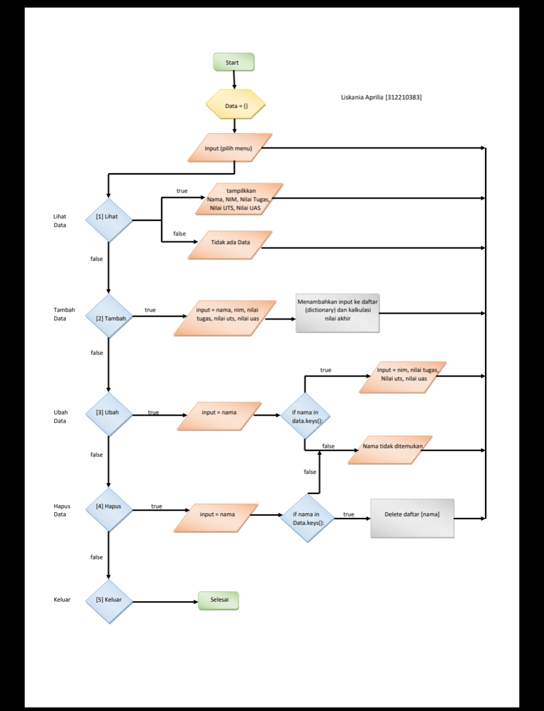

# Latihan 1

Mengubah kode dibawah ini menjadi fungsi menggunakan lambda

# Code :

``` python

import math
def a(x):
    return x**2

def b(x, y):
    return math.sqrt(x**2 + y**2)

def c(*args):
    return sum(args) / len(args)

def d(s):
    return "".join(set(s))

```
# Code Program :

``` python 
print("=================================")
print("Nama     : Liskania Aprilia")
print("NIM      : 312210383")
print("=================================")

import math
def a(x):
    return x**2
    a = lambda x: x**2, a
print(a(2))

def b(x, y):
    return math.sqrt(x**2 + y**2)
    b = lambda x, y: x**2 + y**2,
print(b(2, 4))

def c(*args):
    return sum(args) / len(args)
    c = lambda*args: sum(args) / 1
print(c(10, 50))

def d(s):
    return "".join(set(s))
    d = lambda s: "".join(set(s))
print(d("Jaehyun"))
```

# Program yang dijalankan :


# Hasil dari program yang sudah dijalankan :


# Praktikum 6

1. Buat program sederhana dengan mengaplikasikan penggunaan fungsi yang akan menampilkan daftar nilai mahasiswa, dengan ketentuan:

- Fungsi tambah() untuk menambah data.
- Fungsi tampilkan() untuk menampilkan data.
- Fungsi hapus(nama) untuk menghapus data berdasarkan nama.
- Fungsi ubah(nama) untuk mengubah data berdasarkan nama.
- Buat Flowchart dan Penjelasan Programnya pada README.md.
- Commit dan push repository ke github.

#  Flowchart dari program yang akan dijalankan :


# Penjelasan Program :

1. Definisikan dictionary terlebih dahulu data = {}.

2. Membuat fungsi

- Fungsi tampilkan(), untuk menambahkan data def tampilkan()

- Fungsi tambah(), untuk menampilkan data def tambah()

- Fungsi hapus(nama), untuk menghapus nama pada data def hapus(nama)

- Fungsi ubah(nama), untuk mengubah nama pada data def ubah(nama)

3. Menggunakan Perulangan while True: dapat diartikan perulangan akan terus mengulang jika inputan benar dan masuk kedalam proses jika tidak maka perulangan berhenti atau lanjut ke proses selanjutnya. Gunakan statement if untuk memproses perintah yang di inginkan sesuai inputan.

4. Untuk menambahkan data pilih "[1] Tambah" gunakan fungsi if gunakan perintah "1", lalu masukan nama, nim, tugas, uts, uas, nilaiakhir, nilai akhir didapat dari = ((tugas)*30/100 + (uts)*35/100 + (uas)*35/100.

5. Lalu jika ingin memilih "[2] Lihat" gunakan fungsi 'elif' dan gunakan fungsi 'for x in data.items():' untuk melihat data pada tabel data yang kita inputkan, dengan perintah "2". Jika data tidak terdaftar maka akan tampil "TIDAK ADA DATA" atau = 0.

6. Lalu untuk menampilan pilihan "[3] Ubah" gunakan fungsi 'elif' kemudian gunakan fungsi 'if nama in data.keys():' kemudian input nama, nim, nilai tugas, nilai uts, nilai uas untuk mengubah data nama kemudian gunakan fungsi 'else' untuk menampilkan data nama yang kita ingin ubah tidak ada.

7. Untuk menghapus data pilih "[4] Hapus" gunakan fungsi 'elif' kemudian gunakan fungsi 'if nama in data.keys():' kemudian fungsi 'del.data[nama] jika nama yang kita hapus tidak ada dalam tabel maka gunakan fungsi 'else' untuk menampilkan "TIDAK ADA DATA".

8. Untuk keluar maka gunakan fungsi else dan exit() atau gunakan perintah [5] Keluar.

# Code Program :
``` python

print("=====================================")
print("Nama : Liskania Aprilia")
print("NIM  : 312210383")
print("=====================================")

data = {}
# Untuk Menambahkan Data
def tambah():
    print()
    print("Tambah Data")
    nama  = input    ("Nama        : ")
    nim   = input    ("NIM         : ")
    tugas = int(input("Nilai Tugas : "))
    uts   = int(input("Nilai UTS   : "))
    uas   = int(input("Nilai UAS   : "))
    nilaiakhir = ((tugas) * 30 / 100 + (uts) * 35 / 100 + (uas) * 35 / 100)
    data[nama] = [nim, tugas, uts, uas, nilaiakhir]
    return

# Untuk Menampilkan Data
def tampilkan():
    if data.items():
        print()
        print("Daftar Nilai")
        print()
        print("=======================================================================================");
        print("|     NAMA    |      NIM      |    TUGAS    |     UTS     |     UAS     | Nilai Akhir |");
        print("=======================================================================================");
        i = 0
        for x in data.items():
            i+=i
            print("|  {0:9}  |   {1:9}   |  {2:9}  |  {3:9}  |  {4:9}  |  {5:9}  |"
                  .format(x[0][: 14], x[1][0], x[1][1], x[1][2], x[1][3], x[1][4], i))
            print("=======================================================================================");

    else :
        print()
        print("Daftar Nilai")
        print()
        print("======================================================================================");
        print("|    NAMA    |      NIM      |    TUGAS    |     UTS     |     UAS     | Nilai Akhir |");
        print("======================================================================================");
        print("|                                  TIDAK ADA DATA                                    |");
        print("======================================================================================");
    return

# Untuk Menghapus data  Berdasarkan Nama
def hapus():
    print()
    print("Hapus Data Mahasiswa")
    nama  = input    ("Nama       : ")
    if nama in data.keys():
        del data[nama]
    else:
        print("Data {0} tidak ada".format(nama))
    return

# Untuk Mengubah data Berdasarkan Nama
def ubah():
    print()
    print("Ubah Data Mahasiswa")
    nama = input("Nama        : ")
    if nama in data.keys():
        nim   = input    ("NIM         : ")
        tugas = int(input("Nilai Tugas : "))
        uts   = int(input("Nilai UTS   : "))
        uas   = int(input("Nilai UAS   : "))
        nilaiakhir = ((tugas) * 30 / 100 + (uts) * 35 / 100 + (uas) * 35 / 100)
        data[nama] = [nim, tugas, uts, uas, nilaiakhir]
    else:
        print("Data nilai{0} tidak ada".format(nama))

while True:
    print()
    print("|1| Lihat Data")
    print("|2| Tambah Data")
    print("|3| Ubah Data")
    print("|4| Hapus Data")
    print("|5| Keluar")

    x = input(">> PILIH MENU : ")

    if x == '1':
        tampilkan()
    elif x == '2':
        tambah()
    elif x == '3':
        ubah()
    elif x == '4':
        hapus()

    else:

        exit()
```
# Program yang dijalankan :
- 

- 

- 

- 

# Hasil dari program yang dijalankan :

- 

- 

- 

- 

- 
